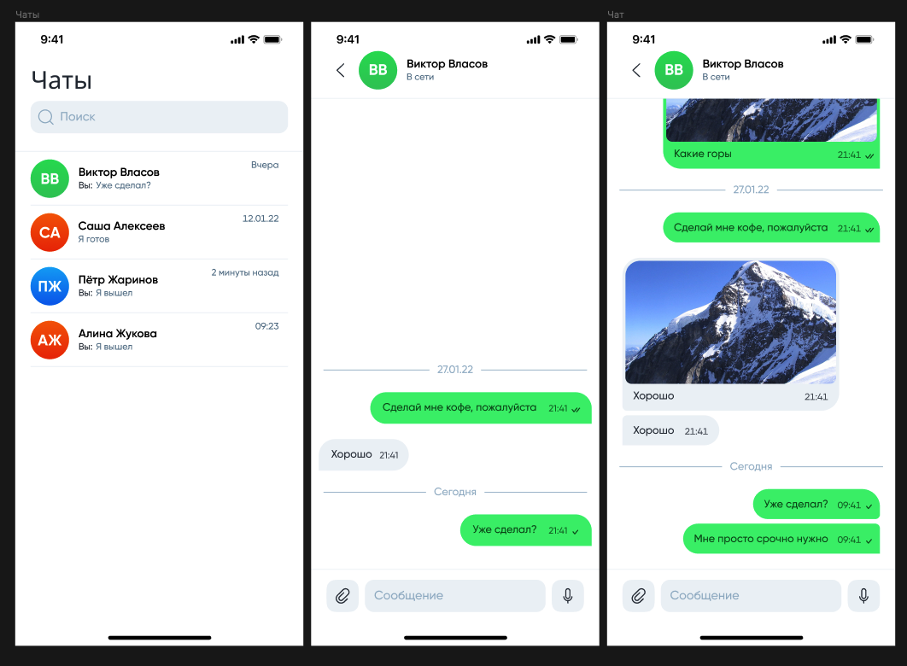
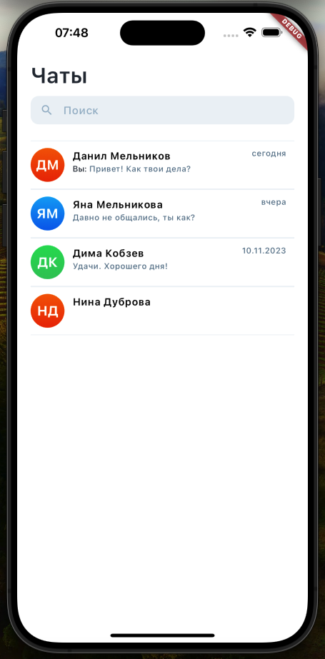
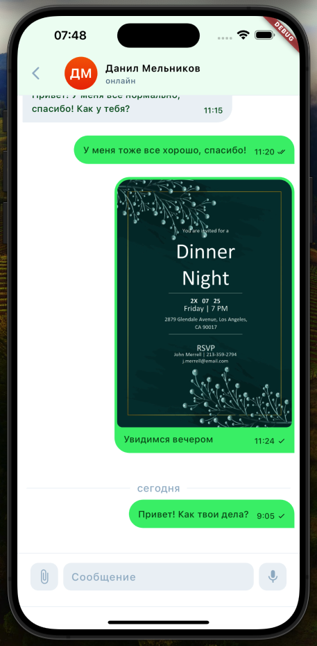
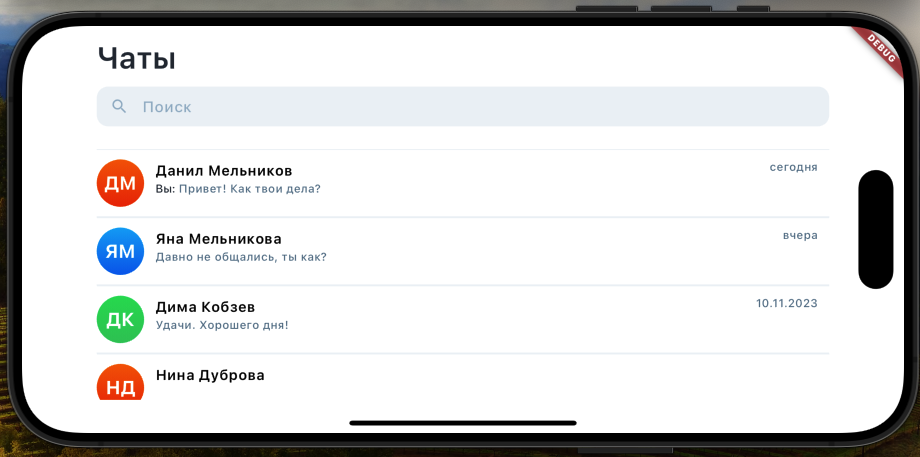
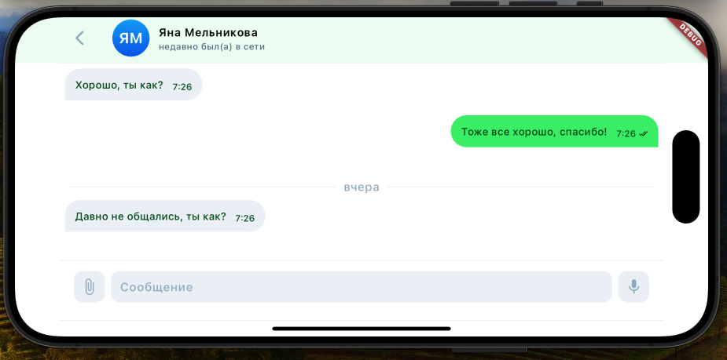

# Проект "Мессенджер"

Этот проект был создан в рамках самостоятельного обучения, выполненного по шаблону компании, которая предоставила его в качестве технического задания для позиции разработчика Flutter.

## Начало работы

Для запуска проекта выполните следующие шаги:

1. Склонируйте репозиторий на свой компьютер.
2. Убедитесь, что у вас установлен Flutter SDK. Если нет, следуйте инструкциям на [официальном сайте Flutter](https://flutter.dev/docs/get-started/install).
3. Откройте директорию проекта в вашей любимой IDE или текстовом редакторе.
4. Подключите устройство/эмулятор или используйте веб-браузер для запуска проекта.
5. Выполните команду `flutter pub get` для установки зависимостей.
6. После установки зависимостей запустите приложение с помощью команды `flutter run`.

## Структура проекта

- **data**: Содержит функционал, связанный с данными, включая сущности и ошибки.
- **presentation**: Отвечает за представление пользовательского интерфейса, включая Cubits и Pages.
  - **cubits**: Управление бизнес-логикой с использованием паттерна Cubit.
    - **chats**: Управление состоянием, связанным с чатами.
    - **other**: Заглушка для потенциальных дополнительных Cubits.
  - **pages**: Определяет различные экраны пользовательского интерфейса.
    - **chat**: Содержит компоненты пользовательского интерфейса и логику для индивидуальных чатов.
    - **chats**: Управляет интерфейсом для отображения нескольких чатов.
    - **widgets**: Переиспользуемые компоненты пользовательского интерфейса, используемые на разных экранах.

## Изображения

Примеры проекта представлены на следующих изображениях:
#### Дизайн приложения в фигме

#### Реализация приложения

  
  

#### Адаптация приложения

## Ассеты и Шрифты

- **Ассеты**: Проект включает различные изображения примеров, хранящиеся в директории `examples`.
- **Шрифты**: Используемые в проекте шрифты хранятся в директории `fonts`, в особенности, семейство шрифтов Gilroy.

## Примечания

- Файл `figma.png` представляет собой дизайн-макет, предоставленный компанией в качестве эталона для проекта.
- Другие изображения, такие как `chat.png` и `chats.png`, демонстрируют ожидаемый результат работы проекта.

Приятного изучения проекта и успешной работы! 🚀
